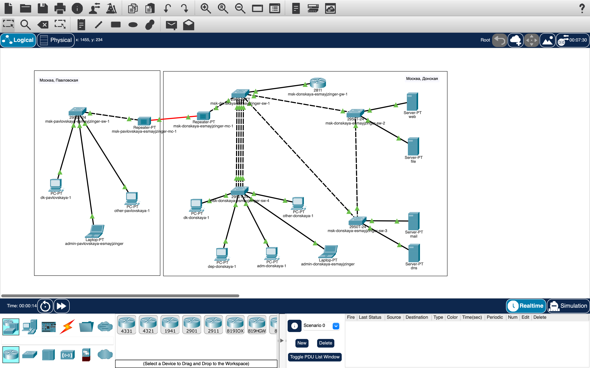

---
## Front matter
title: "Лабораторная работа №10"
subtitle: "Настройка списков управления доступом (ACL)"
author: "Майзингер Эллина Сергеевна"

## Generic otions
lang: ru-RU
toc-title: "Содержание"

## Bibliography
bibliography: bib/cite.bib
csl: pandoc/csl/gost-r-7-0-5-2008-numeric.csl

## Pdf output format
toc: true # Table of contents
toc-depth: 2
lof: true # List of figures
lot: true # List of tables
fontsize: 12pt
linestretch: 1.5
papersize: a4
documentclass: scrreprt
## I18n polyglossia
polyglossia-lang:
  name: russian
  options:
	- spelling=modern
	- babelshorthands=true
polyglossia-otherlangs:
  name: english
## I18n babel
babel-lang: russian
babel-otherlangs: english
## Fonts
mainfont: PT Serif
romanfont: PT Serif
sansfont: PT Sans
monofont: PT Mono
mainfontoptions: Ligatures=TeX
romanfontoptions: Ligatures=TeX
sansfontoptions: Ligatures=TeX,Scale=MatchLowercase
monofontoptions: Scale=MatchLowercase,Scale=0.9
## Biblatex
biblatex: true
biblio-style: "gost-numeric"
biblatexoptions:
  - parentracker=true
  - backend=biber
  - hyperref=auto
  - language=auto
  - autolang=other*
  - citestyle=gost-numeric
## Pandoc-crossref LaTeX customization
figureTitle: "Рис."
tableTitle: "Таблица"
listingTitle: "Листинг"
lofTitle: "Список иллюстраций"
lotTitle: "Список таблиц"
lolTitle: "Листинги"
## Misc options
indent: true
header-includes:
  - \usepackage{indentfirst}
  - \usepackage{float} # keep figures where there are in the text
  - \floatplacement{figure}{H} # keep figures where there are in the text
---

# Цель работы

Освоить настройку прав доступа пользователей к ресурсам сети с использованием списков управления доступом (ACL).

# Задание

1. Настроить правила доступа для следующих серверов:
   - Web-сервер: разрешить HTTP-доступ всем, Telnet и FTP — только администратору.
   - Файловый сервер: доступ к общим каталогам из внутренней сети, FTP — извне.
   - Почтовый сервер: разрешить SMTP и POP3 для всех, Telnet и FTP — администратору.
   - DNS-сервер: открыть UDP-порт 53 для внутренней сети.
   - Разрешить ICMP-сообщения в сеть серверов.
   - Запретить для сети Other любые внешние запросы, кроме администратора.
   - Разрешить доступ к сети управления оборудованием только администратору.

2. Проверить корректность работы ACL.
3. Выполнить самостоятельную работу по настройке прав доступа администратора на Павловской.

# Выполнение лабораторной работы

## 1. Подготовка ноутбука администратора

1. Подключили ноутбук `admin` к порту 24 коммутатора `msk-donskaya-sw-4`.
2. Назначили статический IP-адрес:
   IP: 10.128.6.200
   Gateway: 10.128.6.1
   DNS: 10.128.0.5
   
## Настройка ACL для Web-сервера
Разрешили HTTP-доступ всем:

msk-donskaya-gw-1(config)#ip access-list extended servers-out
msk-donskaya-gw-1(config-ext-nacl)#remark web
msk-donskaya-gw-1(config-ext-nacl)#permit tcp any host 10.128.0.2 eq 80
Добавили доступ администратора по Telnet и FTP:

msk-donskaya-gw-1(config-ext-nacl)#permit tcp host 10.128.6.200 host 10.128.0.2 eq telnet
msk-donskaya-gw-1(config-ext-nacl)#permit tcp host 10.128.6.200 host 10.128.0.2 range 20 ftp
Применили ACL к интерфейсу:

msk-donskaya-gw-1(config)#interface f0/0.3
msk-donskaya-gw-1(config-subif)#ip access-group servers-out out

## Настройка ACL для файлового сервера
Разрешили доступ к общим каталогам из внутренней сети:

msk-donskaya-gw-1(config-ext-nacl)#remark file
msk-donskaya-gw-1(config-ext-nacl)#permit tcp 10.128.0.0 0.0.255.255 host 10.128.0.3 eq 445
Разрешили FTP-доступ извне:
msk-donskaya-gw-1(config-ext-nacl)#permit tcp any host 10.128.0.3 range 20 ftp

## Настройка ACL для почтового сервера
Разрешили SMTP и POP3:

bash
msk-donskaya-gw-1(config-ext-nacl)#remark mail
msk-donskaya-gw-1(config-ext-nacl)#permit tcp any host 10.128.0.4 eq smtp
msk-donskaya-gw-1(config-ext-nacl)#permit tcp any host 10.128.0.4 eq pop3

## Настройка ACL для DNS-сервера
Разрешили внутренний доступ:

msk-donskaya-gw-1(config-ext-nacl)#remark dns
msk-donskaya-gw-1(config-ext-nacl)#permit udp 10.128.0.0 0.0.255.255 host 10.128.0.5 eq 53

## Разрешение ICMP-запросов
Добавили правило в начало списка:

msk-donskaya-gw-1(config-ext-nacl)#i permit icmp any any

## Ограничение сети Other
Запретили внешние запросы, кроме администратора:

msk-donskaya-gw-1(config)#ip access-list extended other-in
msk-donskaya-gw-1(config-ext-nacl)#remark admin
msk-donskaya-gw-1(config-ext-nacl)#permit ip host 10.128.6.200 any
msk-donskaya-gw-1(config-subif)#interface f0/0.104
msk-donskaya-gw-1(config-subif)#ip access-group other-in in

## Доступ к сети управления оборудованием
Разрешили доступ только администратору:

msk-donskaya-gw-1(config)#ip access-list extended management-out
msk-donskaya-gw-1(config-ext-nacl)#remark admin
msk-donskaya-gw-1(config-ext-nacl)#permit ip host 10.128.6.200 10.128.1.0 0.0.0.255
msk-donskaya-gw-1(config)#interface f0/0.2
msk-donskaya-gw-1(config-subif)#ip access-group management-out out

## Проверка корректности ACL
Проверили доступ:

HTTP к Web-серверу с любого узла.

FTP к Web-серверу только с 10.128.6.200.

Доступ к DNS по имени и IP.

ICMP-запросы к серверам.

## Итоговый вид топологии сети

{#fig:004 width=100%}

## Самостоятельная работа
Настроили аналогичные права для администратора на Павловской:

msk-pavlovskaya-gw-1(config)#ip access-list extended pav-admin
msk-pavlovskaya-gw-1(config-ext-nacl)#permit ip host 10.128.7.200 any

## Выводы
Настроены ACL для управления доступом к серверам.

Реализована фильтрация трафика для сети Other.

Обеспечен безопасный доступ администратора к критическим ресурсам.

Проверена корректность работы всех правил.

## Ответы на контрольные вопросы
Как задать действие для протокола?
Использовать синтаксис: permit/deny <протокол> <источник> <назначение>.
Пример: permit tcp any host 10.128.0.2 eq 80.

Как задать несколько портов?
Использовать ключевое слово range.
Пример: permit tcp any host 10.128.0.3 range 20 21.

Как узнать номер правила?
Команда: show access-lists. Выводит список правил с номерами.

Как изменить порядок правил?
Удалить правило (no <номер>) и добавить заново в нужной позиции.