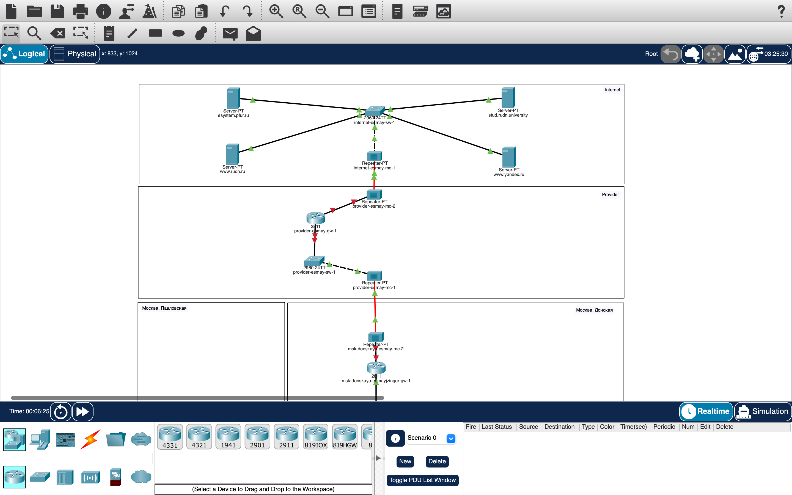

---
## Front matter
title: "Лабораторная работа №11"
subtitle: "Настройка NAT. Планирование"
author: "Майзингер Эллина Сергеевна"

## Generic otions
lang: ru-RU
toc-title: "Содержание"

## Bibliography
bibliography: bib/cite.bib
csl: pandoc/csl/gost-r-7-0-5-2008-numeric.csl

## Pdf output format
toc: true # Table of contents
toc-depth: 2
lof: true # List of figures
lot: true # List of tables
fontsize: 12pt
linestretch: 1.5
papersize: a4
documentclass: scrreprt
## I18n polyglossia
polyglossia-lang:
  name: russian
  options:
	- spelling=modern
	- babelshorthands=true
polyglossia-otherlangs:
  name: english
## I18n babel
babel-lang: russian
babel-otherlangs: english
## Fonts
mainfont: PT Serif
romanfont: PT Serif
sansfont: PT Sans
monofont: PT Mono
mainfontoptions: Ligatures=TeX
romanfontoptions: Ligatures=TeX
sansfontoptions: Ligatures=TeX,Scale=MatchLowercase
monofontoptions: Scale=MatchLowercase,Scale=0.9
## Biblatex
biblatex: true
biblio-style: "gost-numeric"
biblatexoptions:
  - parentracker=true
  - backend=biber
  - hyperref=auto
  - language=auto
  - autolang=other*
  - citestyle=gost-numeric
## Pandoc-crossref LaTeX customization
figureTitle: "Рис."
tableTitle: "Таблица"
listingTitle: "Листинг"
lofTitle: "Список иллюстраций"
lotTitle: "Список таблиц"
lolTitle: "Листинги"
## Misc options
indent: true
header-includes:
  - \usepackage{indentfirst}
  - \usepackage{float} # keep figures where there are in the text
  - \floatplacement{figure}{H} # keep figures where there are in the text
---

# Цель работы

Провести подготовительные мероприятия по подключению локальной сети организации к Интернету с использованием технологии NAT (Network Address Translation).

# Задание

1. Построить схему подключения локальной сети к Интернету.
2. Создать модельные сети провайдера и Интернета.
3. Настроить оборудование согласно топологии.
4. Заполнить таблицы распределения IP-адресов и VLAN.

# Теоретические сведения

## Типы NAT
- **Статический NAT (SNAT)**: преобразование 1:1 (один локальный IP → один внешний IP).
- **Динамический NAT (DNAT)**: преобразование 1:N (один локальный IP → один из пула внешних IP).
- **NAT Overload (PAT)**: преобразование N:1 (множество локальных IP → один внешний IP с использованием портов).

# Выполнение лабораторной работы

## Построение схемы сети

1. Добавили в схему L1:
   - Сеть провайдера с оборудованием:
     - Маршрутизатор `provider-gw-1`
     - Коммутатор `provider-sw-1`
     - Медиаконвертеры `provider-mc-1`, `provider-mc-2`
   - Модельный Интернет:
     - Серверы: `www.yandex.ru`, `www.rudn.ru`, `stud.rudn.university`, `esystem.pfur.ru`
     - Коммутатор `internet-sw-1`
     - Медиаконвертер `internet-mc-1`

2. Назначили IP-адреса согласно таблице:

| Устройство             | IP-адрес      |
|------------------------     |----------------  |
| provider-gw-1           | 192.0.2.1     |
| www.yandex.ru         | 192.0.2.11  |
| stud.rudn.university  | 192.0.2.12  |
| esystem.pfur.ru         | 192.0.2.13   |
| www.rudn.ru             | 192.0.2.14  |

## Настройка оборудования

1. Заменили модули медиаконвертеров:
   PT-REPEATER-NM-1FFE (для витой пары)
   PT-REPEATER-NM-1CFE (для оптоволокна)
Настроили соединения между устройствами согласно схеме L1.

Прописали DNS-записи на сервере в сети "Донская":

bash
www.yandex.ru          - 192.0.2.11
stud.rudn.university   - 192.0.2.12
esystem.pfur.ru        - 192.0.2.13
www.rudn.ru            - 192.0.2.14

## Настройка NAT (для последующих работ)
Пример настройки PAT на маршрутизаторе:

provider-gw-1(config)# ip nat pool PUBLIC_POOL 198.51.100.1 198.51.100.1 netmask 255.255.255.0
provider-gw-1(config)# ip nat inside source list PRIVATE_NET pool PUBLIC_POOL overload
provider-gw-1(config)# access-list PRIVATE_NET permit 10.128.0.0 0.0.255.255
provider-gw-1(config)# interface FastEthernet0/0
provider-gw-1(config-if)# ip nat inside
provider-gw-1(config-if)# interface FastEthernet0/1
provider-gw-1(config-if)# ip nat outside

## Итоговый вид топологии сети

{#fig:004 width=100%}
{#fig:004 width=100%}

## Выводы

Построена схема подключения локальной сети к Интернету через провайдера.
Настроено модельное окружение Интернета с тестовыми серверами.
Подготовлена инфраструктура для последующей настройки NAT.
Заполнены таблицы распределения адресов и VLAN.

## Ответы на контрольные вопросы
Что такое NAT?
Механизм преобразования IP-адресов для обеспечения доступа устройств с приватными адресами в Интернет.

Как определить узел за NAT?
По наличию приватного IP-адреса (10.x.x.x, 172.16.x.x-172.31.x.x, 192.168.x.x).

Какое оборудование отвечает за NAT?
Маршрутизатор на границе сети (например, provider-gw-1).

Отличие типов NAT:

SNAT: 1:1

DNAT: 1:N

PAT: N:1 с использованием портов

Характеристика типов NAT:
SNAT - для серверов, DNAT - для пула адресов, PAT - для массового доступа.