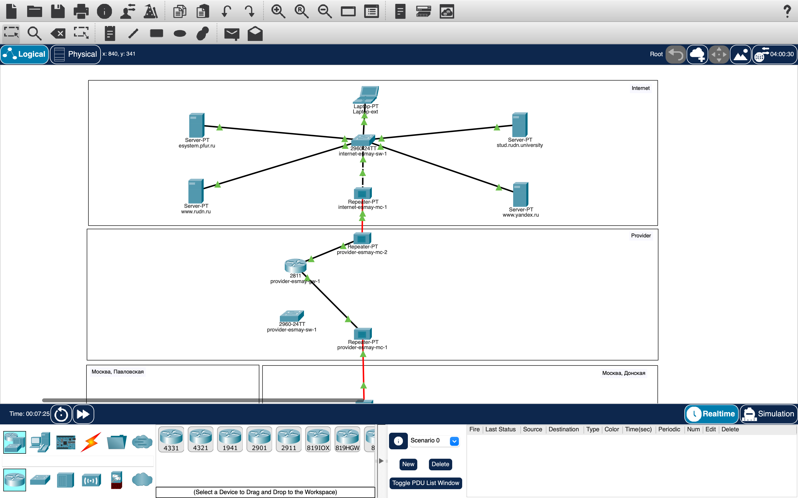

# Информация

## Докладчик

:::::::::::::: {.columns align=center}
::: {.column width="70%"}

* Майзингер Эллина Сергеевна  
* студент  
* НПИбд-02-22  
* Российский университет дружбы народов  
* [1132226489@pfur.ru](mailto:1132226489@pfur.ru)  

:::
::::::::::::::

# Цель работы

- Настройка контролируемого доступа в Интернет
- Обеспечение безопасности при публикации серверов
- Практическое применение NAT

# Типы NAT

:::::::::::::: {.columns}
::: {.column width="33%"}
**Статический**
- Для серверов
- 1:1
:::

::: {.column width="33%"}
**Динамический**
- Для пула пользователей
- N:M
:::

::: {.column width="33%"}
**PAT (Overload)**
- Для массового доступа
- N:1 + порты
:::
::::::::::::::

# Архитектура решения

- Локальная сеть > NAT > Провайдер > Интернет
- Разные правила для VLAN

# Ключевые настройки

ip nat pool main-pool 198.51.100.2 198.51.100.14
ip nat inside source list nat-inet pool main-pool overload
ip nat inside source static tcp 10.128.0.2 80 198.51.100.2 80

Проверка
Ограничения доступа
Доступность серверов
RDP администратора

# Итоговая топология 

# Итоговая топология 2

# Выводы
Реализован гибкий контроль доступа

Обеспечена безопасная публикация сервисов

Все требования задания выполнены

# Итоговая топология 

