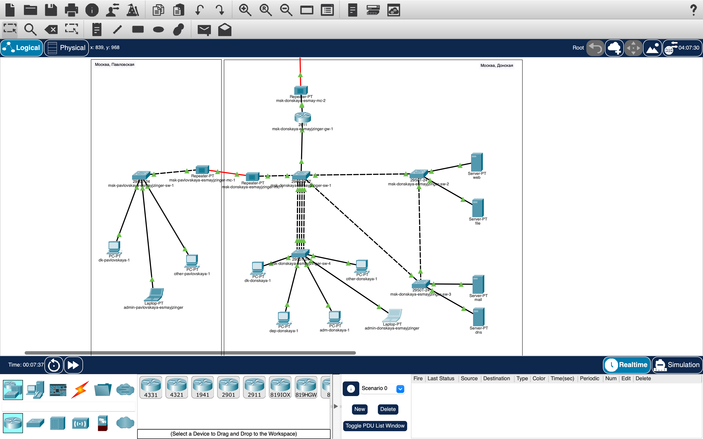

---
## Front matter
title: "Лабораторная работа №12"
subtitle: "Настройка NAT"
author: "Майзингер Эллина Сергеевна"

## Generic otions
lang: ru-RU
toc-title: "Содержание"

## Bibliography
bibliography: bib/cite.bib
csl: pandoc/csl/gost-r-7-0-5-2008-numeric.csl

## Pdf output format
toc: true # Table of contents
toc-depth: 2
lof: true # List of figures
lot: true # List of tables
fontsize: 12pt
linestretch: 1.5
papersize: a4
documentclass: scrreprt
## I18n polyglossia
polyglossia-lang:
  name: russian
  options:
	- spelling=modern
	- babelshorthands=true
polyglossia-otherlangs:
  name: english
## I18n babel
babel-lang: russian
babel-otherlangs: english
## Fonts
mainfont: PT Serif
romanfont: PT Serif
sansfont: PT Sans
monofont: PT Mono
mainfontoptions: Ligatures=TeX
romanfontoptions: Ligatures=TeX
sansfontoptions: Ligatures=TeX,Scale=MatchLowercase
monofontoptions: Scale=MatchLowercase,Scale=0.9
## Biblatex
biblatex: true
biblio-style: "gost-numeric"
biblatexoptions:
  - parentracker=true
  - backend=biber
  - hyperref=auto
  - language=auto
  - autolang=other*
  - citestyle=gost-numeric
## Pandoc-crossref LaTeX customization
figureTitle: "Рис."
tableTitle: "Таблица"
listingTitle: "Листинг"
lofTitle: "Список иллюстраций"
lotTitle: "Список таблиц"
lolTitle: "Листинги"
## Misc options
indent: true
header-includes:
  - \usepackage{indentfirst}
  - \usepackage{float} # keep figures where there are in the text
  - \floatplacement{figure}{H} # keep figures where there are in the text
---

# Цель работы

Приобретение практических навыков настройки доступа локальной сети к внешней сети с использованием технологии NAT (Network Address Translation) с учетом заданных ограничений.

# Задание

1. Настроить доступ в Интернет для различных VLAN с ограничениями:
   - Управление устройствами: без доступа
   - Дисплейные классы: только учебные сайты
   - Кафедры: только образовательные ресурсы
   - Администрация: только сайт университета
   - Other: полный доступ только для администратора

2. Обеспечить доступность серверов из Интернета:
   - Web-сервер: порт 80
   - Почтовый сервер: порты 25 и 110
   - Файловый сервер: порты FTP
   - RDP-доступ к компьютеру администратора

3. Проверить работоспособность всех настроек.

# Теоретические сведения

## Типы NAT
- **Статический NAT**: 1 внутренний IP → 1 внешний IP (для серверов)
- **Динамический NAT**: пул внутренних IP → пул внешних IP
- **PAT (NAT Overload)**: множество внутренних IP → 1 внешний IP с использованием портов

# Выполнение лабораторной работы

## 1. Настройка оборудования провайдера

1. Базовая настройка маршрутизатора `provider-gw-1`:
   enable secret cisco
   service password-encryption
   username admin privilege 1 secret cisco
   interface f0/0.4
     encapsulation dot1Q 4
     ip address 198.51.100.1 255.255.255.240
Настройка коммутатора provider-sw-1:

vlan 4
name nat
interface f0/1
  switchport mode trunk
  
2. Настройка маршрутизатора локальной сети
Интерфейс для подключения к провайдеру:
interface f0/1.4
  encapsulation dot1Q 4
  ip address 198.51.100.2 255.255.255.240
  ip nat outside
Статический маршрут по умолчанию:
ip route 0.0.0.0 0.0.0.0 198.51.100.1

3. Настройка NAT
Создание пула адресов:

ip nat pool main-pool 198.51.100.2 198.51.100.14 netmask 255.255.255.240
ACL для ограничения доступа:

ip access-list extended nat-inet
  remark dk
  permit tcp 10.128.3.0 0.0.0.255 host 192.0.2.11 eq 80  # Яндекс
  permit tcp 10.128.3.0 0.0.0.255 host 192.0.2.12 eq 80  # РУДН

  remark departments
  permit tcp 10.128.4.0 0.0.0.255 host 192.0.2.13 eq 80  # eSystem

  remark adm
  permit tcp 10.128.5.0 0.0.0.255 host 192.0.2.14 eq 80  # www.rudn.ru

  remark admin
  permit ip host 10.128.6.200 any
  
Включение PAT:
ip nat inside source list nat-inet pool main-pool overload

Назначение интерфейсов:
interface f0/0.101  # dk
  ip nat inside
interface f0/0.104  # other
  ip nat inside
  
## Публикация серверов

Web-сервер:
ip nat inside source static tcp 10.128.0.2 80 198.51.100.2 80

Почтовый сервер:
ip nat inside source static tcp 10.128.0.4 25 198.51.100.4 25
ip nat inside source static tcp 10.128.0.4 110 198.51.100.4 110

RDP для администратора:
ip nat inside source static tcp 10.128.6.200 3389 198.51.100.10 3389

## Проверка работоспособности

Проверка доступа из VLAN:
Дисплейные классы: доступ только к Яндекс и РУДН

Кафедры: доступ только к eSystem

Администрация: доступ только к www.rudn.ru

Other: полный доступ только с 10.128.6.200

Проверка серверов извне:
Web-сервер доступен на 198.51.100.2:80
Почта доступна на 198.51.100.4:25 и :110
RDP работает на 198.51.100.10:3389

## Итоговый вид топологии сети

{#fig:004 width=100%}
{#fig:004 width=100%}

## Выводы
Настроен контролируемый доступ в Интернет для разных групп пользователей.

Обеспечена безопасная публикация внутренних серверов.

Проверена работоспособность всех правил NAT и ограничений.

Достигнуто соответствие всем требованиям задания.

## Ответы на контрольные вопросы
Принцип NAT
Преобразование приватных IP в публичные для выхода в Интернет, экономия адресов.

Настройка NAT
На граничном маршрутизаторе: пул адресов, ACL, интерфейсы inside/outside.

NAT на субинтерфейсах
Да, можно применять к субинтерфейсам (как в работе).

Пул IP NAT
Диапазон внешних адресов для преобразования (198.51.100.2-14).

Статический NAT
Постоянное сопоставление 1:1, используется для серверов.