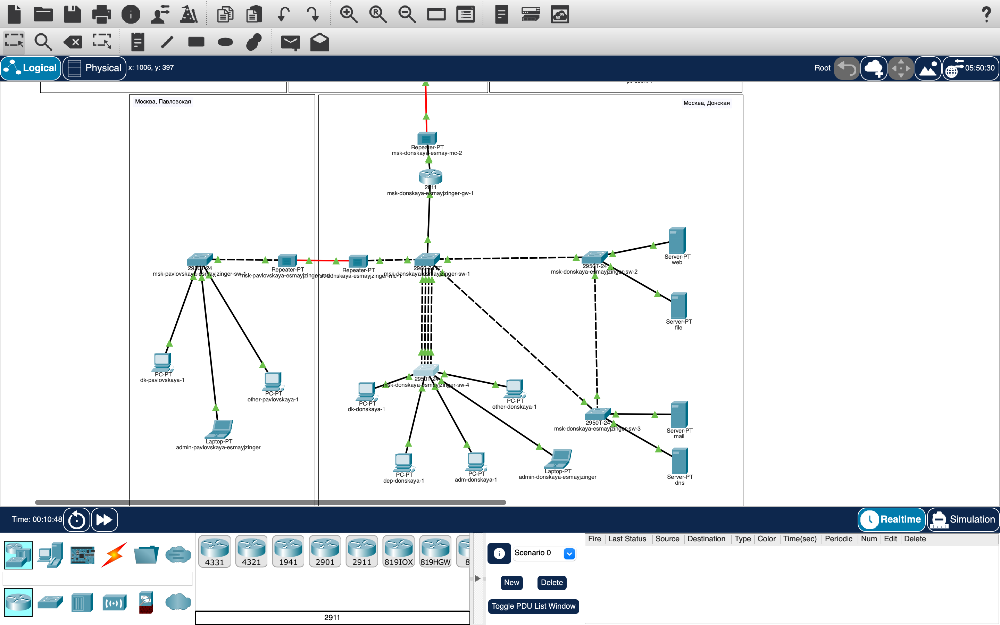

# Информация

## Докладчик

:::::::::::::: {.columns align=center}
::: {.column width="70%"}

* Майзингер Эллина Сергеевна  
* студент  
* НПИбд-02-22  
* Российский университет дружбы народов  
* [1132226489@pfur.ru](mailto:1132226489@pfur.ru)  

:::
::::::::::::::

# Цель работы

- Организация сети с основным офисом и филиалом
- Настройка статической маршрутизации
- Обеспечение связности между площадками

# Архитектура сети

- Основная территория: Москва, 42-й квартал
- Филиал: г. Сочи
- Связь через провайдера

# Ключевые настройки

## Маршрутизатор Москва
interface FastEthernet0/0.5
  ip address 10.128.255.2 255.255.255.252
ip route 0.0.0.0 0.0.0.0 10.128.255.1

## Маршрутизатор Сочи
interface FastEthernet0/0.6
  ip address 10.128.255.6 255.255.255.252
ip route 10.129.0.0 255.255.0.0 10.128.255.5

# Проверка работоспособности
ping между узлами

traceroute: правильные маршруты

Таблицы маршрутизации заполнены корректно

# Итоговая топология 

# Итоговая топология 

# Выводы
Создана распределенная сеть

Настроена статическая маршрутизация

Все узлы сети связаны

Требования задания выполнены

# Итоговая топология 

