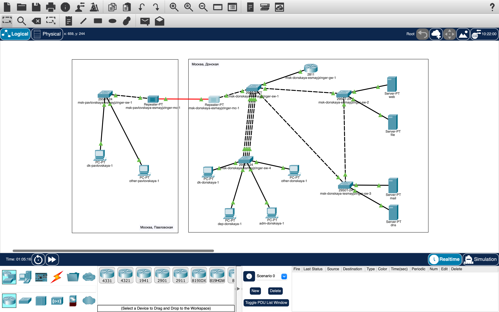

# Информация

## Докладчик

:::::::::::::: {.columns align=center}
::: {.column width="70%"}

* Майзингер Эллина Сергеевна  
* студент  
* НПИбд-02-22  
* Российский университет дружбы народов  
* [1132226489@pfur.ru](mailto:1132226489@pfur.ru)  

:::
::::::::::::::

# Цель работы

- Настройка взаимодействия между основной сетью (Москва) и филиалом (Сочи)
- Реализация статической маршрутизации через провайдера
- Обеспечение полной связности сети

# Архитектура сети

## Основные компоненты
- **Москва (42-й квартал)**
  - Маршрутизатор msk-q42-gw-1
  - Коммутатор msk-q42-sw-1
  - Подсеть 10.129.0.0/24 (VLAN 201)

- **Сочи**
  - Маршрутизатор sch-sochi-gw-1
  - Коммутатор sch-sochi-sw-1
  - Подсеть 10.130.0.0/24 (VLAN 401)

- **Провайдер**
  - Маршрутизатор msk-donskaya-gw-1
  - Коммутатор provider-sw-1

# Ключевые настройки

## Маршрутизатор Москва
```cisco
interface FastEthernet0/1.5
  encapsulation dot1Q 5
  ip address 10.128.255.2 255.255.255.252

interface FastEthernet0/0.201
  encapsulation dot1Q 201
  ip address 10.129.0.1 255.255.255.0

ip route 0.0.0.0 0.0.0.0 10.128.255.1

## Маршрутизатор Сочи
cisco
interface FastEthernet0/0.6
  encapsulation dot1Q 6
  ip address 10.128.255.6 255.255.255.252

interface FastEthernet0/0.401
  encapsulation dot1Q 401
  ip address 10.130.0.1 255.255.255.0

ip route 0.0.0.0 0.0.0.0 10.128.255.5

## Проверка работоспособности
Тестирование соединения
cisco
pc-q42-1> ping 10.130.0.200
PING 10.130.0.200 (10.130.0.200): 56 data bytes
64 bytes from 10.130.0.200: icmp_seq=0 ttl=61 time=12.345 ms
Просмотр маршрутов
cisco
msk-donskaya-gw-1# show ip route
Codes: C - connected, S - static
S    10.129.0.0/16 [1/0] via 10.128.255.2
S    10.130.0.0/16 [1/0] via 10.128.255.6

## Схема сети

VLAN структура
Локация	VLAN ID	Подсеть	Назначение
Москва	201	10.129.0.0/24	Основная сеть
Сочи	401	10.130.0.0/24	Филиал

# Итоговая топология 



# Итоговая топология 


## Выводы
Успешно настроена статическая маршрутизация между площадками

Обеспечена полная связность сети:

Ping между всеми узлами успешен

Маршруты корректно отображаются в таблицах

Все требования задания выполнены:

Настроены VLAN и IP-адресация

Реализован NAT на граничном маршрутизаторе

Документирована конфигурация

# Итоговая топология 


