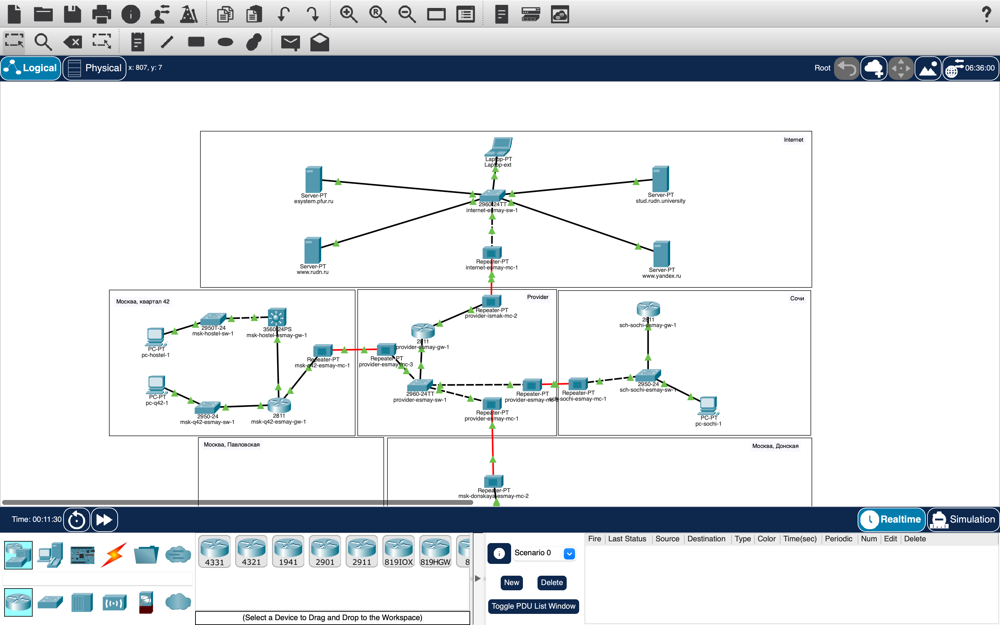
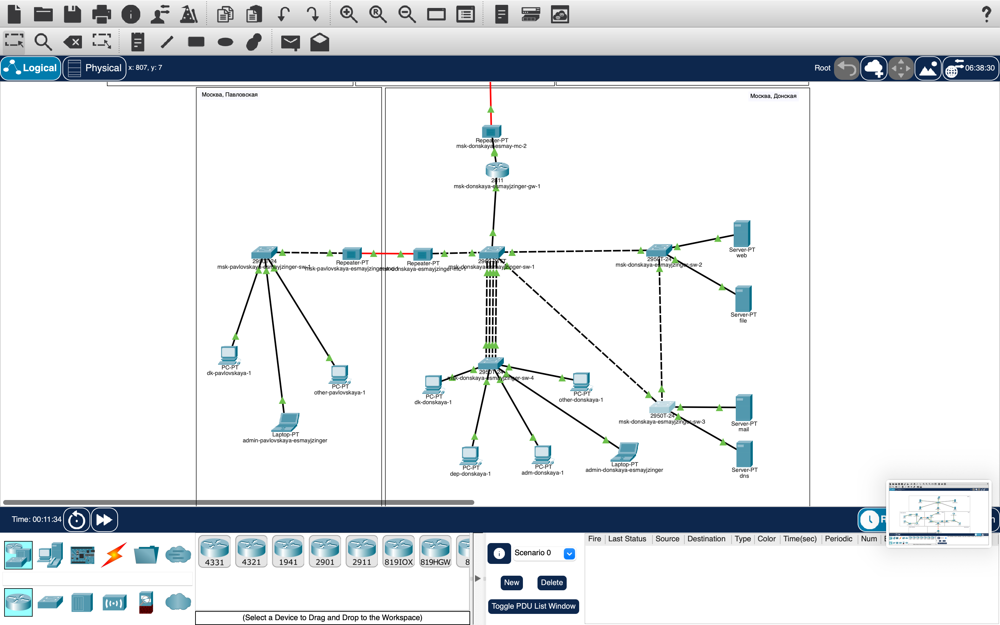

# Информация

## Докладчик

:::::::::::::: {.columns align=center}
::: {.column width="70%"}

* Майзингер Эллина Сергеевна  
* студент  
* НПИбд-02-22  
* Российский университет дружбы народов  
* [1132226489@pfur.ru](mailto:1132226489@pfur.ru)  

:::
::::::::::::::

# Цель работы

Настройка динамической маршрутизации OSPF между:
- Основной площадкой (Москва)
- Филиалом (Сочи)
- Сетью провайдера

# Архитектура решения

## Распределение адресов
| Устройство          | Router ID      | Интерфейсы OSPF       |
|---------------------|----------------|-----------------------|
| msk-donskaya-gw-1   | 10.128.254.1   | 10.128.255.1/30       |
| msk-q42-gw-1        | 10.128.254.2   | 10.128.255.2/30       |
| sch-sochi-gw-1      | 10.128.254.4   | 10.128.255.6/30       |

# Ключевые настройки

## Конфигурация OSPF
router ospf 1
 router-id 10.128.254.1
 network 10.0.0.0 0.255.255.255 area 0
## Прямой линк Москва-Сочи
interface f0/1.7
 ip address 10.128.255.9 255.255.255.252
# Проверка работы
## До отключения VLAN 6
cisco
Laptop-PT admin> ping 10.130.0.200
Reply from 10.130.0.200: bytes=32 time=12ms TTL=61
## После отключения VLAN 6
cisco
Laptop-PT admin> ping 10.130.0.200
Reply from 10.130.0.200: bytes=32 time=8ms TTL=61

# Итоговая топология 

# Итоговая топология 

# Выводы
OSPF обеспечивает автоматическую маршрутизацию

Прямой линк повышает отказоустойчивость

Динамическая маршрутизация адаптируется к изменениям сети

