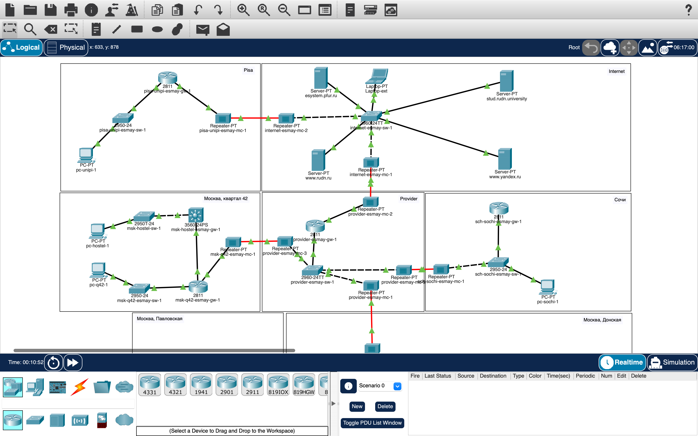
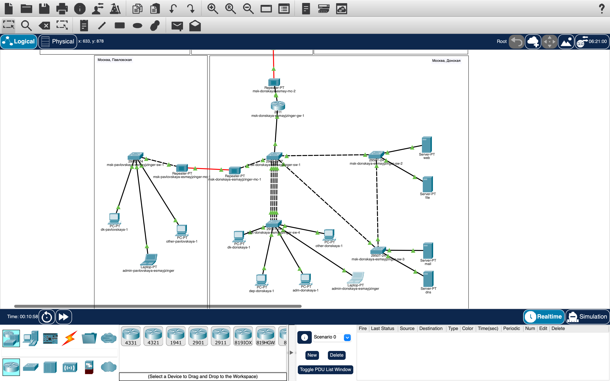

# Информация

## Докладчик

:::::::::::::: {.columns align=center}
::: {.column width="70%"}

* Майзингер Эллина Сергеевна  
* студент  
* НПИбд-02-22  
* Российский университет дружбы народов  
* [1132226489@pfur.ru](mailto:1132226489@pfur.ru)  

:::
::::::::::::::

# Цель работы

Создание защищенного VPN-соединения между:
- Сетью "Донская" (Москва)
- Университетом г. Пиза (Италия)

# Архитектура решения

## Параметры туннеля
| Параметр          | Москва          | Пиза            |
|-------------------|-----------------|-----------------|
| Tunnel IP         | 10.128.255.253  | 10.128.255.254  |
| Источник          | 198.51.100.2    | 192.0.2.20      |
| Назначение        | 192.0.2.20      | 198.51.100.2    |

# Ключевые настройки

## Конфигурация туннеля (Москва)
interface Tunnel0
 ip address 10.128.255.253 255.255.255.252
 tunnel source f0/1.4
 tunnel destination 192.0.2.20
## Маршрутизация через туннель
ip route 10.131.0.0 255.255.255.0 10.128.255.254

# Проверка работы
## Доступность узлов
Laptop-PT admin> ping 10.131.0.100
Reply from 10.131.0.100: bytes=32 time=45ms TTL=127
## Состояние туннеля
msk-donskaya-gw-1#show interface tunnel0
Tunnel0 is up, line protocol is up

# Итоговая топология 

 

# Итоговая топология 

 

# Выводы
GRE-туннель успешно установлен

Обеспечена безопасная связь между сетями

Все узлы доступны через VPN-соединение

