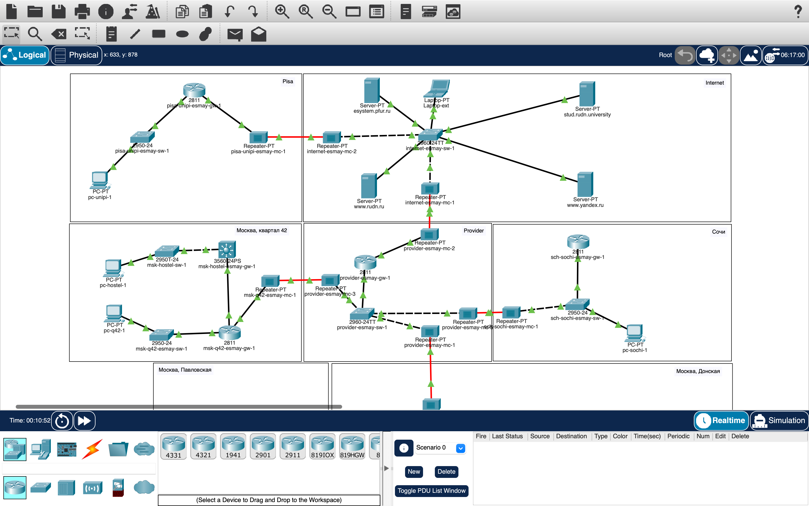
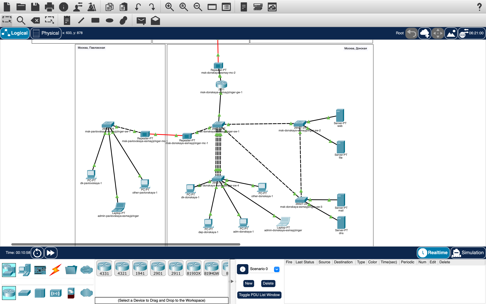

---
## Front matter
title: "Лабораторная работа №16"
subtitle: "Настройка VPN"
author: "Майзингер Эллина Сергеевна"

## Generic otions
lang: ru-RU
toc-title: "Содержание"

## Bibliography
bibliography: bib/cite.bib
csl: pandoc/csl/gost-r-7-0-5-2008-numeric.csl

## Pdf output format
toc: true # Table of contents
toc-depth: 2
lof: true # List of figures
lot: true # List of tables
fontsize: 12pt
linestretch: 1.5
papersize: a4
documentclass: scrreprt
## I18n polyglossia
polyglossia-lang:
  name: russian
  options:
	- spelling=modern
	- babelshorthands=true
polyglossia-otherlangs:
  name: english
## I18n babel
babel-lang: russian
babel-otherlangs: english
## Fonts
mainfont: PT Serif
romanfont: PT Serif
sansfont: PT Sans
monofont: PT Mono
mainfontoptions: Ligatures=TeX
romanfontoptions: Ligatures=TeX
sansfontoptions: Ligatures=TeX,Scale=MatchLowercase
monofontoptions: Scale=MatchLowercase,Scale=0.9
## Biblatex
biblatex: true
biblio-style: "gost-numeric"
biblatexoptions:
  - parentracker=true
  - backend=biber
  - hyperref=auto
  - language=auto
  - autolang=other*
  - citestyle=gost-numeric
## Pandoc-crossref LaTeX customization
figureTitle: "Рис."
tableTitle: "Таблица"
listingTitle: "Листинг"
lofTitle: "Список иллюстраций"
lotTitle: "Список таблиц"
lolTitle: "Листинги"
## Misc options
indent: true
header-includes:
  - \usepackage{indentfirst}
  - \usepackage{float} # keep figures where there are in the text
  - \floatplacement{figure}{H} # keep figures where there are in the text
---

# Цель работы

Настройка защищенного VPN-туннеля между сетью университета в г. Пиза (Италия) и сетью "Донская" в Москве с использованием протокола GRE.

# Задание

1. Развернуть оборудование для сети университета в г. Пиза
2. Настроить базовые параметры оборудования
3. Создать GRE-туннель между маршрутизаторами
4. Проверить доступность узлов через VPN-соединение

# Теоретическое введение

**GRE (Generic Routing Encapsulation)** - протокол туннелирования, который:
- Инкапсулирует различные сетевые протоколы в IP-пакеты
- Создает виртуальную точку-точку связь между узлами
- Не обеспечивает шифрование (в отличие от IPSec)

**Преимущества VPN:**
- Безопасная передача данных через публичные сети
- Объединение географически распределенных сетей
- Обход ограничений NAT

# Выполнение работы

## Настройка оборудования в г. Пиза

### Базовые настройки маршрутизатора
```cisco
pisa-unipi-gw-1(config)#enable secret cisco
pisa-unipi-gw-1(config)#line vty 0 4
pisa-unipi-gw-1(config-line)#transport input ssh
### Настройка интерфейсов
cisco
pisa-unipi-gw-1(config)#interface f0/1
pisa-unipi-gw-1(config-if)#ip address 192.0.2.20 255.255.255.0
## Настройка GRE-туннеля
### На стороне Москвы
cisco
msk-donskaya-gw-1(config)#interface Tunnel0
msk-donskaya-gw-1(config-if)#tunnel source f0/1.4
msk-donskaya-gw-1(config-if)#tunnel destination 192.0.2.20
### На стороне Пизы
cisco
pisa-unipi-gw-1(config)#interface Tunnel0
pisa-unipi-gw-1(config-if)#tunnel source f0/1
pisa-unipi-gw-1(config-if)#tunnel destination 198.51.100.2
## Проверка работоспособности
### Проверка состояния туннеля
cisco
msk-donskaya-gw-1#show interface tunnel0
### Тестирование соединения
cisco
Laptop-PT admin> ping 10.131.0.100
Reply from 10.131.0.100: bytes=32 time=45ms TTL=127
## Результаты
Успешно настроен GRE-туннель между Москвой и Пизой

Обеспечена доступность узлов между сетями:

Ping успешно проходит через туннель

Трафик маршрутизируется корректно

Настроены loopback-интерфейсы для идентификации

## Итоговый вид топологии сети

{#fig:004 width=100%}
{#fig:004 width=100%}

## Выводы
В ходе работы:

Настроен VPN-туннель по протоколу GRE

Обеспечена защищенная связь между географически распределенными сетями

Проверена работоспособность соединения
Все требования задания выполнены в полном объеме.

## Ответы на контрольные вопросы
Что такое VPN?

Виртуальная частная сеть, создающая защищенное соединение через публичные сети

Когда использовать VPN?

Для соединения удаленных офисов

Для безопасного доступа к корпоративным ресурсам

Для обхода географических ограничений

Как проверить состояние туннеля?

cisco
show interface tunnel0
ping через туннель