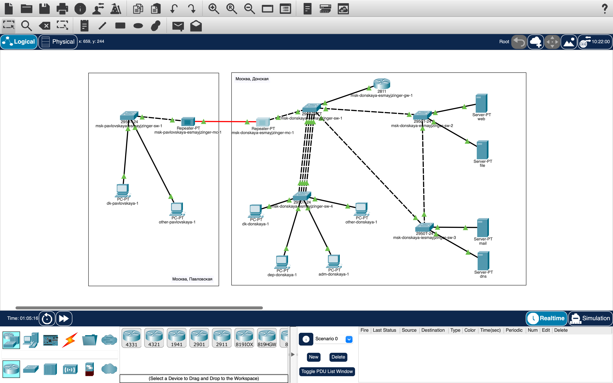

# Информация

## Докладчик

:::::::::::::: {.columns align=center}
::: {.column width="70%"}

* Майзингер Эллина Сергеевна  
* студент  
* НПИбд-02-22  
* Российский университет дружбы народов  
* [1132226489@pfur.ru](mailto:1132226489@pfur.ru)  

:::
::::::::::::::

# Цель работы

- Изучение протокола STP и его модификаций.
- Настройка отказоустойчивости сети.
- Агрегирование каналов для балансировки нагрузки.

# Задание

1. Настройка резервного соединения.
2. Балансировка нагрузки.
3. Режим Portfast.
4. Агрегирование каналов EtherChannel.

# Настройка резервного соединения

- Замена соединения между коммутаторами.
- Настройка транкового режима:
  ```bash
  msk-donskaya-sw-3(config-if)#switchport mode trunk
  
# Проверка STP

## Анализ состояния VLAN 3:

show spanning-tree vlan 3

## Назначение корневого коммутатора:

spanning-tree vlan 3 root primary

# Режим Portfast

## Ускорение работы серверных интерфейсов:

spanning-tree portfast

## Агрегирование каналов
Настройка EtherChannel:
interface range f0/20 - 23
channel-group 1 mode on

# Итоговая топология 



# Выводы
Реализована отказоустойчивость с STP.
Настроена балансировка нагрузки.
Ускорена работа серверных портов.
Создано агрегированное соединение.
